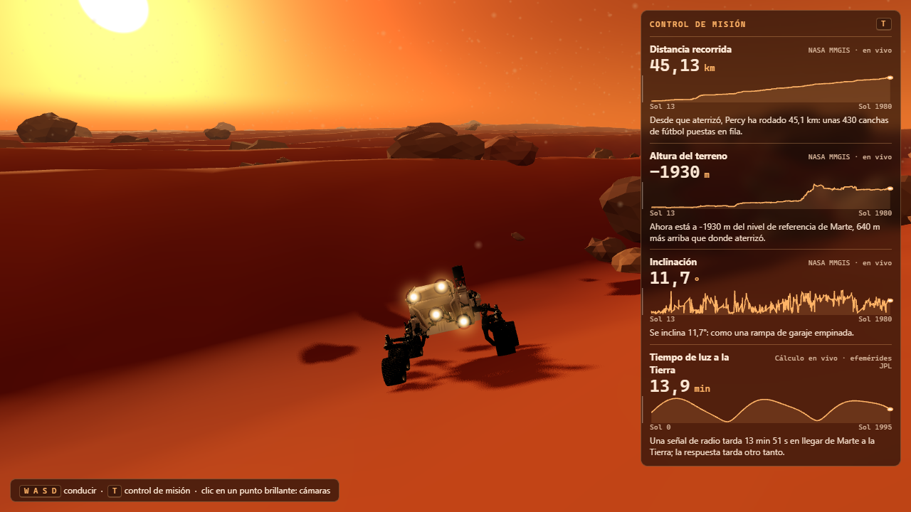
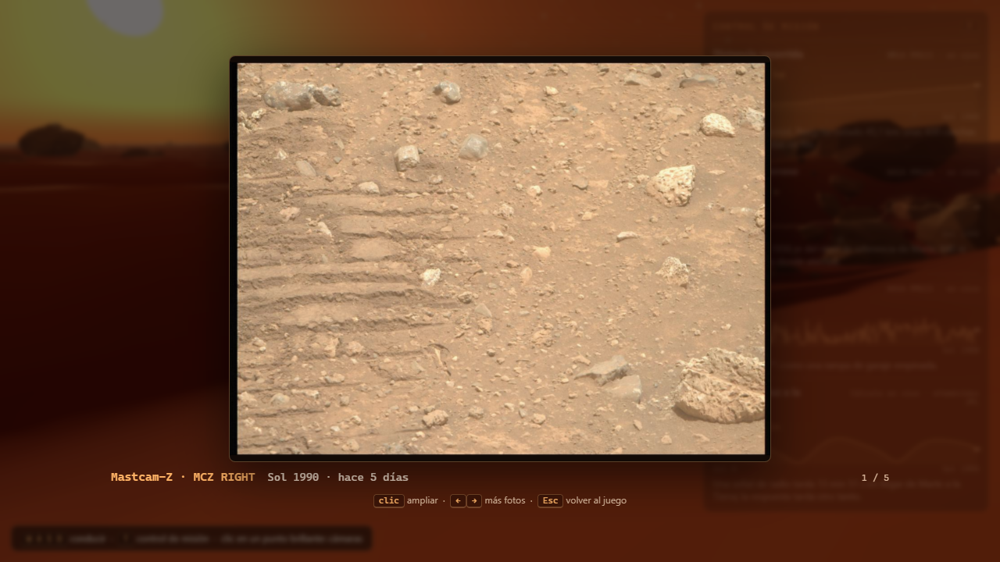
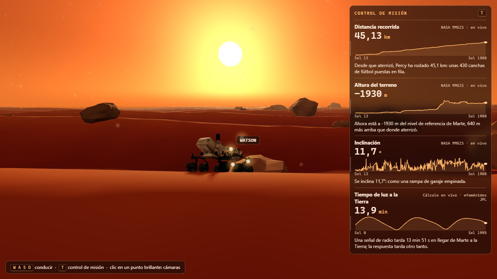

# Perseverance en Marte

Simulación 3D del rover Perseverance sobre la superficie de Marte, hecha con Vite y Three.js. Se conduce con el teclado, deja huellas, sube rocas pequeñas y se detiene ante las grandes. Incluye un control de misión con datos reales de la NASA y cámaras que muestran fotos reales del rover.



| Fotos reales desde las cámaras | El rover ante una roca grande |
|---|---|
|  |  |

## Qué incluye

- Paisaje de Marte: dunas, rocas, cielo color caramelo con polvo, sol de tarde con sombras suaves y las dos lunas (Fobos y Deimos).
- Modelo 3D oficial de Perseverance (NASA) a tamaño real, con 6 ruedas independientes que giran, se orientan y se mueven con la suspensión.
- Físicas de rocas: las bajas (menos de 45 cm) se suben, las grandes bloquean el paso.
- Control de misión con 4 datos: distancia recorrida, altura del terreno, inclinación y tiempo de luz Tierra-Marte. Cada uno con valor, unidad, proveedor, gráfica de toda la misión y una frase que explica qué significa.
- 4 cámaras (Mastcam-Z, Navcam, Hazcam frontal y WATSON) que abren fotos reales de Marte.

## Requisitos

- **Node.js 18 o superior** (probado con 21.6) y npm.
- **Google Chrome** instalado, solo para `npm run check`. No se descarga ningún navegador.
- Conexión a internet para los datos en vivo de la NASA. Sin red el juego usa una copia guardada del historial de manejos.

## Instalación

```bash
npm install
```

Instala `three`, `vite` (versión 5, compatible con Node 18+) y `playwright-core` (para las pruebas).

## Iniciar el servicio

```bash
npm run dev
```

Abre http://localhost:5173. Vite recarga la página cuando editas el código.

Otros comandos:

| Comando | Qué hace |
|---|---|
| `npm run dev` | Servidor de desarrollo en el puerto 5173 |
| `npm run build` | Genera la versión de producción en `dist/` |
| `npm run check` | Prueba automática con captura de pantalla (ver más abajo) |

## Cómo se juega

| Tecla / acción | Efecto |
|---|---|
| `W` `S` | Avanzar y retroceder |
| `A` `D` | Girar a la izquierda y a la derecha |
| `T` | Ocultar o mostrar el control de misión |
| Clic en un punto brillante del rover | Tomar una foto con esa cámara |
| Clic en la foto | Ampliar o reducir |
| `←` `→` | Ver otras fotos de la misma cámara |
| `Esc` | Cerrar la foto y volver al juego |

Con una foto abierta el rover no recibe teclas. Si no tocas nada, la foto se cierra sola a los 14 segundos.

## Cómo probarlo

```bash
npm run check
```

El comando abre la página en un Chrome sin ventana (el que ya tienes instalado), conduce el rover y guarda capturas en `screenshots/`. Termina con error si hay algo roto. Comprueba:

1. La escena carga sin errores ni avisos en la consola.
2. El rover se detecta con 6 ruedas, que giran al avanzar y al girar, y deja huellas.
3. Una roca grande detiene al rover y una roca baja se puede cruzar.
4. Los 4 datos del control de misión cargan con números reales, y la tecla `T` oculta y vuelve a mostrar el panel.
5. Un clic real sobre la Mastcam-Z abre una foto; las flechas cambian de foto; `Esc` vuelve al juego. Las otras 3 cámaras también abren una foto real.

Capturas que genera: `check.png`, `check-mission.png`, `check-hover.png`, `check-camera.png` (foto abierta), `check-rock.png` y `check-drive.png`. La carpeta `screenshots/` no se sube al repositorio.

Si Chrome no está en la ruta de Windows por defecto, indica dónde está:

```bash
CHROME_PATH="/ruta/a/chrome" npm run check
```

El Chrome sin ventana renderiza despacio, así que la prueba puede tardar varios minutos.

## Estructura

```text
index.html               Página que carga el juego
src/
  main.js                Escena, bucle principal, cámara de seguimiento y teclas
  terrain.js, noise.js   Dunas y ruido
  rocks.js               Rocas y colisiones (cúpulas sobre el terreno)
  sky.js, moons.js       Cielo con polvo, sol y las dos lunas
  rover.js, wheels.js    Modelo del rover, huellas, ruedas y suspensión
  telemetry.js           Datos con nombre, unidad y proveedor (patrón de Open MCT)
  mission.js             Panel del control de misión
  cameras.js             Puntos de cámara y visor de fotos
  style.css              Interfaz del juego
public/
  models/perseverance.glb   Modelo oficial de la NASA
  draco/                    Decodificador para el modelo comprimido
  data/waypoints.json       Copia del historial de manejos de la NASA
  photos/                   Fotos elegidas por cámara + manifest.json
vite.config.js           Configuración de Vite (destino moderno para el build)
scripts/check.mjs        Prueba automática
docs/                    Capturas y copia local del artefacto de Open MCT
```

## Datos y fotos

- **Historial de manejos** (distancia, altura del terreno, inclinación): `https://mars.nasa.gov/mmgis-maps/M20/Layers/json/M20_waypoints.json`. Se pide en vivo; la copia local es `public/data/waypoints.json`.
- **Tiempo de luz Tierra-Marte**: calculado en el navegador con las posiciones aproximadas de ambos planetas (elementos orbitales de JPL).
- **Fotos de las cámaras**: API de imágenes crudas de Mars 2020, `https://mars.nasa.gov/rss/api/?feed=raw_images&category=mars2020&feedtype=json&ver=1.2&num=100&page=0&order=sol+desc`. Para una cámara concreta se añade `&search=%7CNAVCAM_LEFT%7C`. Las 20 fotos del juego (5 por cámara, de los sols 1989 a 1994) se descargaron y están en `public/photos/`; son un conjunto fijo, no se actualiza solo.
- **Modelo 3D**: [NASA-3D-Resources](https://github.com/nasa/NASA-3D-Resources), carpeta `3D Models/Mars 2020 Perseverance Rover`.

Los datos, las fotos y el modelo son de la NASA/JPL-Caltech. Revisa las [pautas de uso de contenido de la NASA](https://www.nasa.gov/nasa-brand-center/images-and-media/) antes de redistribuirlos.

## Referencias

- Repositorio de ejemplo y referencia: https://github.com/Feloguarin/perseverancia/tree/main/src
- Repositorio de la NASA (Open MCT, v4.3.1): https://github.com/nasa/openmct
- Artefacto que explica Open MCT (privado, solo lo abre su dueño): https://claude.ai/artifact/6GUrmgQtbanTWwKbvcBj13
- Copia local del artefacto, para consultarlo sin conexión a claude.ai: [`docs/open-mct/mapa-open-mct.html`](docs/open-mct/mapa-open-mct.html). Ábrela en el navegador; los diagramas necesitan internet para dibujarse.

## Prompts

Los 5 prompts con los que se construyó el proyecto, en el orden en que se usaron. El texto es el original, con los caracteres dañados corregidos.

### 1. Crear el entorno 3D de Marte

```text
Estamos en una carpeta vacía. Crea un proyecto con Vite y Three.js y prende el servidor apenas puedas. Yo lo veo en vivo en el navegador de Cursor.

Quiero un paisaje de Marte que se vea de película: dunas, rocas, cielo color caramelo con polvo, un sol de tarde con luz cálida y sombras suaves, y las dos lunas de Marte.

Que se vea algo en menos de 2 minutos después de aprobar el plan y después lo mejoras. Para revisarte, crea npm run check: abre la página en un Chrome invisible (Playwright con mi Chrome, sin descargar navegadores), guarda una captura y lista los errores de consola. Córrelo tras cada mejora grande, mira la captura y corrige. Máximo 3 rondas. Listo cuando no haya errores y la captura muestre todo lo pedido.
```

### 2. Agregar el rover basado en el modelo oficial de la NASA

```text
Ahora trae el rover de verdad. Descarga el modelo 3D oficial de Perseverance de la NASA en public/models/:
https://raw.githubusercontent.com/nasa/NASA-3D-Resources/master/3D%20Models/Mars%202020%20Perseverance%20Rover/Mars%202020%20Perseverance%20Rover.glb
Ponlo a tamaño real sobre el terreno. Que se maneje con las teclas WASD, deje huellas y la cámara lo siga.
En la consola, escribe los nombres de las piezas que son cámaras. Las usaremos al final.
```

### 3. Crear el artefacto para entender el repositorio

```text
Necesito que crees un artefacto para entender este repositorio https://github.com/nasa/openmct, usa 2 agentes, uno para enfocarte en la parte de arquitectura y otro para seguir revisando todo el código, esto para facilitar el entendimiento de cómo funciona, ya que luego será necesario para la siguiente fase de integración en el proyecto
```

### 4. Integrar la telemetría

```text
Ahora aplícalo a nuestro juego: arma un control de misión dentro de la simulación, con el patrón que encontraste en Open MCT (cada dato con su nombre, unidad y proveedor) y 4 datos reales de Percy:
- Distancia recorrida, altura del terreno e inclinación, del historial de manejos de la NASA: https://mars.nasa.gov/mmgis-maps/M20/Layers/json/M20_waypoints.json
- Tiempo de luz entre la Tierra y Marte, calculado en vivo.
Cada dato con su valor, una gráfica de toda la misión y una frase simple de qué significa. Que se sienta parte del juego y que la tecla T lo oculte. No instales nada. Sin fotos: esas son del acto 3.
Listo cuando: los 4 muestran números reales y T lo oculta. Amplía npm run check para que confirme que los 4 cargaron y que la consola no tiene errores.
```

### 5. Agregar la funcionalidad para ver las fotos

```text
Ahora la experiencia mágica: que las cámaras de Percy tomen fotos reales de Marte.
- Muestra 4 cámaras como puntos que brillan sobre sus piezas del modelo (Mastcam_Z_cams, NavCams, hazcams_front, WATSON), con su nombre al pasar el mouse.
- Al hacer clic: obturador y flash, y la foto se revela poco a poco. Se queda quieta unos segundos, grande y fácil de ver; clic para ampliar, Esc para volver al juego, flechas para ver más fotos de esa cámara.
- Fotos de esta API: https://mars.nasa.gov/rss/api/?feed=raw_images&category=mars2020&feedtype=json&ver=1.2&num=100&page=0&order=sol+desc (por cámara: &search=%7CNAVCAM_LEFT%7C)
- De cada cámara, las más impresionantes de los últimos días: a color, que se sienta Marte (horizonte, el brazo sobre el suelo, rocas de cerca). Nada de cielo vacío, sol, calibración ni miniaturas. Descarga y mira las fotos antes de escoger.
- Cada foto dice cámara, sol y hace cuántos días.
Listo cuando: cada cámara abre una foto real. Amplía npm run check para que haga clic en una cámara y guarde la captura con la foto abierta.
```
